# Explainable Color-Channel Modeling for Glucose and Ketone Sensing

**포도당 및 케톤 센싱을 위한 설명 가능한 색상 채널 모델링**

비색센서 패치의 색상으로 포도당과 케톤 농도를 예측하고, 모델이 어떤 색상 변화에 근거해 판단했는지를 확인하는 연구임. 패치에서 추출한 색상값을 사용하는 머신러닝과 패치 이미지를 직접 사용하는 딥러닝의 성능 및 설명가능성 비교가 목적임.

> **연구 질문**
> 색상 특징 기반 모델과 이미지 기반 모델이 포도당·케톤 농도를 얼마나 정확하게 예측하며, 그 판단 근거가 실제로 관찰된 센서 색 변화와 일치하는지에 대한 평가

### 연구 흐름

**원본 이미지 19장 → 패치 1,824개 추출 → RGB·HSV 특징 생성 → ML·DL 학습 → 교차검증 성능 비교 → SHAP·Permutation 분석 → 재현성 평가 → 색상 변화와 설명 방향 비교**

## 진행 현황

| 단계 | 내용 | 상태 |
|---:|---|:---:|
| 1 | 분석 단위 및 데이터 구조 확정 | ✅ |
| 2 | 원형 패치 자동 검출 | ✅ |
| 3 | 색상 특징 추출 | ✅ |
| 4 | 색상 특징 검증 | ✅ |
| 5 | 교차검증 데이터 분할 | ✅ |
| 6 | 머신러닝 모델 학습 | ✅ |
| 7 | 딥러닝 모델 학습 | ✅ |
| 8 | 교차검증 기반 모델 성능 평가 | ✅ |
| 9 | SHAP 및 Permutation Importance 분석 | ✅ |
| 10 | 특징 중요도의 재현성 평가 | ✅ |
| 11 | 색상 변화와 모델 설명의 화학적 개연성 비교 | ✅ |

### 현재까지의 핵심 결과

- 19개 이미지에서 원형 패치 1,824개를 누락 없이 추출함
- 포도당과 케톤에서 농도에 따라 반복되는 RGB·HSV 변화 경향을 확인함
- 센서 배열 위치에 따른 색상 편향을 확인하여 같은 위치가 학습과 시험에 겹치지 않는 분할을 확정함
- 현재 내부 검증에서 색상 특징 ML이 이미지 CNN보다 낮은 패치 단위 MAE를 보임
- 케톤의 흰색 배경에도 농도 관련 정보가 남아 있어 촬영 조건 교란 가능성을 확인함
- RGB 모델에서는 G, HSV 모델에서는 Hue가 두 분석물의 주된 예측 특징으로 반복됨
- 주요 특징의 SHAP 기여 방향이 관찰된 농도별 색 변화 방향과 5개 fold 모두에서 일치함

---

## 1. 분석 단위 및 데이터 구조 ✅

### 사용 데이터

| 분석물 | 측정 농도 | 원본 이미지 | 이미지당 패치 | 전체 패치 |
|---|---:|---:|---:|---:|
| 포도당 | 11개 | 11장 | 96개 | 1,056개 |
| 케톤 | 8개 | 8장 | 96개 | 768개 |
| **전체** | **19개** | **19장** |  | **1,824개** |

- 원본 이미지 1장이 하나의 농도를 나타내는 구조
- 각 이미지에 `8 × 12` 배열의 원형 센서 패치 96개가 포함된 구조
- 원형 패치 1개를 머신러닝과 딥러닝의 공통 분석 단위로 사용
- 배열 위치를 `A01–H12`의 `well_id`로 구분
- 농도 범위와 색 변화가 다른 포도당과 케톤을 별도 모델로 분석

> **해석상 주의**
> 분석 가능한 패치는 1,824개이지만 독립적으로 촬영된 원본 이미지는 19장임. 같은 이미지의 96개 패치는 독립적인 촬영 반복이 아니라 한 사진 안의 기술적 관측값임. 이후 성능은 새로운 플레이트나 촬영 조건에 대한 외부 검증이 아닌 현재 19개 이미지 내부의 패치 수준 검증으로 해석해야 함.

---

## 2. 원형 패치 자동 검출 ✅

### 목적

19개 원본 이미지에서 원형 센서 패치를 동일한 기준과 순서로 분리하는 단계임.

### 처리 과정

1. 이미지 방향 보정
2. 원형 패치 후보 검출
3. 센서 배열 밖의 배경 후보 제거
4. 검출된 원을 `8 × 12` 격자에 맞춰 정렬
5. 왼쪽 위부터 `A01–H12` 순서로 위치 ID 부여
6. 패치별 개별 이미지 생성

### 결과

- 19개 원본 이미지에서 각각 96개 패치 검출
- 총 1,824개 패치 생성
- 누락·중복 ID 및 손상 이미지 0개
- 모든 이미지에서 동일한 배열 순서 유지

아래 그림의 파란 원과 위치 ID를 통해 실제 센서 배열과 검출 순서의 일치 여부 확인 가능함.

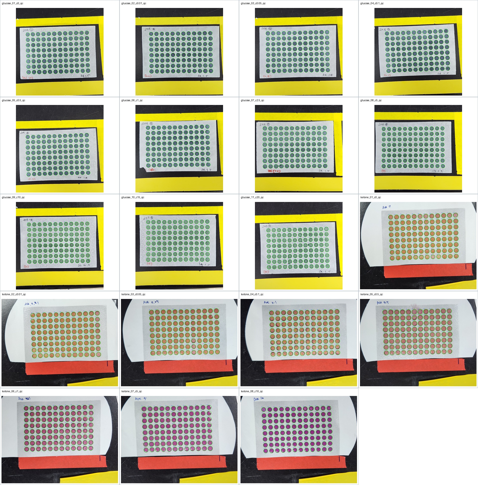

---

## 3. 색상 특징 추출 ✅

### 분석 영역 설정

센서 테두리와 흰색 반사광의 영향을 줄이기 위해 패치 전체가 아닌 중앙 영역에서 색상값을 추출함.

| 그림 표시 | 의미 | 분석에서의 역할 |
|---|---|---|
| **초록색 원 내부** | 패치 중앙의 센서 영역 | 주 분석 RGB·HSV 추출 영역 |
| **파란색 두 원 사이** | 패치 바깥의 흰색 기판 | 조명·배경 변화 확인용 영역 |
| **빨간색 픽셀** | 흰색 반사광 | 색상 계산에서 제외되는 영역 |

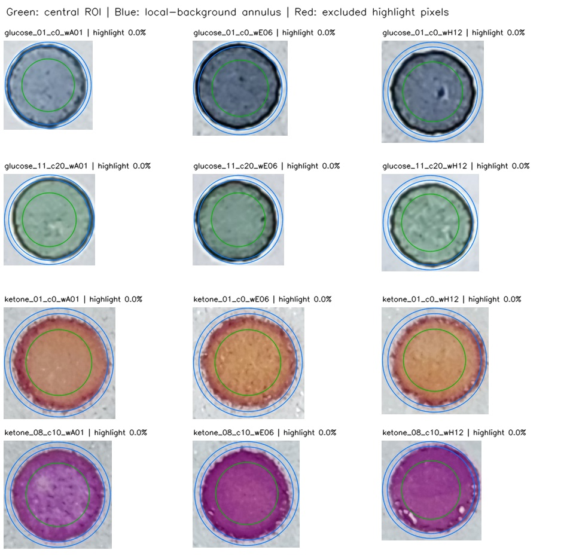

### 적용한 기준

- 센서 중심에서 패치 반지름의 70%에 해당하는 영역 사용
- 지나치게 밝고 채도가 낮은 픽셀을 반사광으로 판단하여 제외
- 흰색 배경은 센서 색상과 분리하여 촬영 조건 점검에만 사용
- 모든 포도당·케톤 패치에 동일한 기준 적용
- 임의의 화이트밸런스와 색상 보정 미적용

### 추출한 색상 정보

| 특징 | 의미 | 사용 목적 |
|---|---|---|
| R, G, B | 빨강·초록·파랑 채널값 | RGB 기반 모델의 주 입력 |
| H, S, V | 색조·채도·밝기 | HSV 기반 모델의 주 입력 |
| 채널별 IQR·표준편차 | 패치 내부 색상 균일성 | 보조 분석 |
| 흰색 배경 RGB | 촬영 배경의 색상 변화 | 음성 대조 및 품질 점검 |

RGB에서 변환되는 HSV는 RGB와 독립적인 정보가 아님. 따라서 RGB-only와 HSV-only 모델을 우선 비교하고 RGB+HSV 결합 모델은 보조 결과로 해석함.

### 추출 품질

- 전체 1,824개 패치에서 색상 특징 추출 완료
- 결측값·무한값·중복 패치 ID 0개
- 패치별 유효 픽셀 비율 최소 93.893%
- 패치별 반사광 비율 최대 6.107%
- 고정된 품질 기준에 따른 제외 패치 0개

---

## 4. 색상 특징 검증 ✅

### 4-1. 농도에 따른 RGB 변화

각 상자는 같은 농도 이미지에 포함된 96개 패치의 색상 분포이며, 선과 점은 농도별 대표값의 변화임.

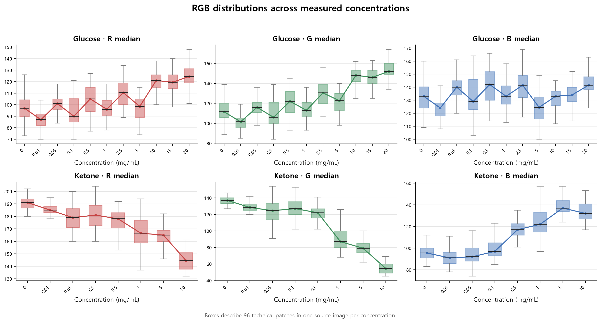

- 포도당에서 G 채널이 농도 증가와 함께 전반적으로 증가하는 경향
- 케톤에서 R과 G 채널이 농도 증가와 함께 뚜렷하게 감소하는 경향
- 케톤 B 채널은 R·G와 다른 방향으로 변화하는 경향

### 4-2. 농도에 따른 HSV 변화

Hue는 색의 종류, Saturation은 채도, Value는 밝기를 의미함. Hue는 0°와 360°가 연결된 값이므로 단순 평균 대신 원형 통계를 적용함.

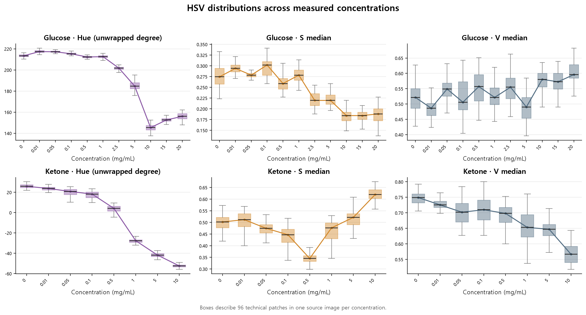

| 분석물 | 농도와 강한 관계를 보인 특징 | Spearman ρ | 관찰된 방향 |
|---|---|---:|---|
| 포도당 | G median | 0.900 | 농도 증가에 따른 증가 |
| 포도당 | Hue | -0.900 | 농도 증가에 따른 감소 |
| 포도당 | S median | -0.819 | 농도 증가에 따른 감소 |
| 케톤 | Hue | -1.000 | 모든 농도에서 일관된 감소 |
| 케톤 | G median | -0.976 | 농도 증가에 따른 감소 |
| 케톤 | R median | -0.976 | 농도 증가에 따른 감소 |
| 케톤 | V median | -0.976 | 농도 증가에 따른 감소 |

Spearman ρ는 농도가 증가할 때 색상값이 한 방향으로 얼마나 일관되게 변하는지를 나타내는 값임. 절댓값이 1에 가까울수록 단조 관계가 강함.

### 4-3. 구분이 어려운 농도 구간

- 포도당 `10–15 mg/mL`에서 R·G·S·V 분포의 큰 중첩
- 케톤 `0.05–0.1 mg/mL`에서 R·G·V 분포의 큰 중첩
- 전체 고농도 범위의 일괄적인 포화보다 특정 인접 농도 구간의 색 변화 정체로 해석
- 이후 모델의 농도별 오차를 함께 확인해야 하는 구간

### 4-4. 패치 위치에 따른 색상 편향

같은 농도 이미지 안에서도 센서 배열의 위치에 따라 색상값이 달라지는 현상을 확인함. 아래 그림은 농도별 대표 색상을 제거한 뒤 위치에 남은 차이를 나타냄.

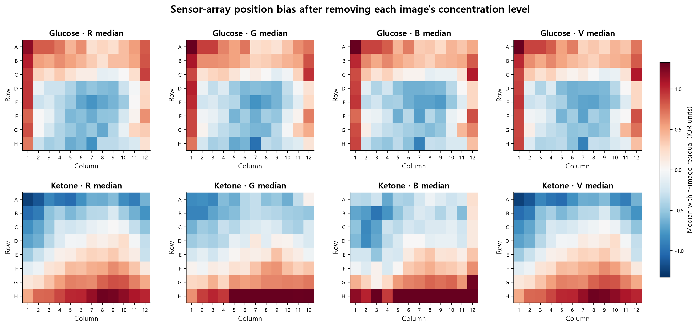

- 포도당 가장자리 패치의 밝기와 RGB 값이 내부보다 높은 경향
- 케톤 가장자리 패치의 채도가 내부보다 낮은 경향
- 위치별 최대 차이가 포도당 1.366 IQR, 케톤 2.181 IQR 수준
- 위치 정보를 농도 예측 특징으로 사용하지 않는 원칙
- 같은 위치가 학습과 시험에 동시에 포함되지 않도록 그룹 분할이 필요한 근거

### 4-5. 모델에 사용할 색상 특징

| 분석 구분 | 포함 특징 | 역할 |
|---|---|---|
| RGB-only | R, G, B median | 주 분석 |
| HSV-only | Hue의 sin·cos, S와 V median | 주 분석 |
| RGB+HSV | 두 주 특징군의 결합 | 상관성 확인용 보조 분석 |
| Chromaticity | 밝기를 정규화한 r·g 성분 | 밝기 영향 평가용 보조 분석 |
| 흰색 배경 RGB | 센서 밖 배경색 | 촬영 조건 교란 확인용 음성 대조 |

흰색 배경의 농도 연관성은 센서 색상보다 약했으나 케톤 배경 G에서 무시하기 어려운 변화가 확인됨. 따라서 배경 RGB는 주 모델에서 제외하고 모델이 센서 밖의 촬영 조건에 의존하는지 확인하는 음성 대조로만 사용함.

---

## 5. 교차검증 데이터 분할 ✅

### 분할 원칙

- 같은 배열 위치의 패치가 학습과 시험에 동시에 들어가는 정보 누수 방지
- `well_id`를 하나의 그룹으로 묶는 5-fold 교차검증 적용
- 포도당 11개와 케톤 8개 농도에서 같은 `well_id`에 해당하는 19개 패치를 항상 동일한 역할에 배정
- 농도와 가장자리·내부 위치 비율을 fold 사이에 균등 배분
- 포도당과 케톤 모델에 동일한 외부 test fold 적용
- 무작위 섞기와 고정 seed `240920` 적용

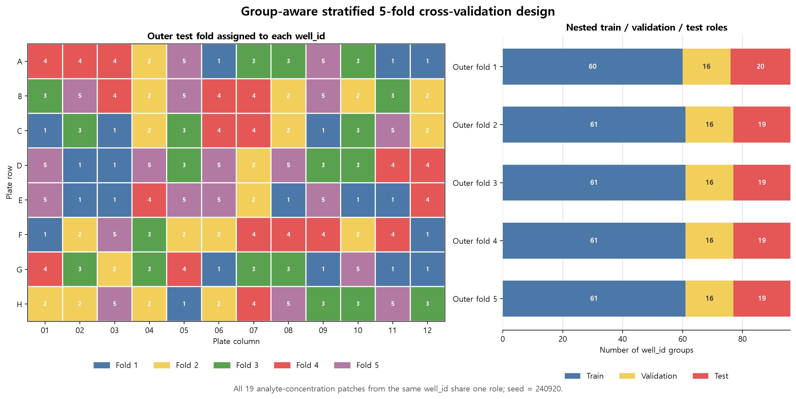

왼쪽 그림의 숫자는 각 위치가 시험 데이터로 사용되는 외부 fold 번호임. 오른쪽 막대는 딥러닝에서 각 fold의 학습·검증·시험 위치 수를 나타냄.

### 머신러닝

- 각 외부 fold에서 76개 또는 77개 위치를 학습에 사용
- 나머지 20개 또는 19개 위치를 최종 시험에 사용
- 외부 학습 데이터 안의 내부 5-fold를 하이퍼파라미터 선택에 사용
- 외부 시험 데이터는 최종 성능 평가 전까지 사용하지 않는 구조

### 딥러닝

- 머신러닝과 동일한 외부 시험 위치 사용
- 외부 학습 데이터 중 16개 위치를 validation에 사용
- 나머지 60개 또는 61개 위치를 실제 학습에 사용
- validation을 조기 종료와 최종 epoch 선택에만 사용

### 분할 검증 결과

- 전체 1,824개 패치의 fold 배정 완료
- 외부 test fold 사이의 `well_id` 중복 0건
- 모든 fold에서 포도당 11개·케톤 8개 농도의 동일 표본 수 유지
- 외부 test의 가장자리 위치를 8·7·7·7·7개로 균등 배분
- 동일 seed를 사용할 때 같은 분할이 생성되는 구조

이 분할은 동일 위치의 직접적인 중복을 막지만 같은 원본 이미지의 서로 다른 위치가 학습과 시험에 함께 포함되는 한계가 남음. 따라서 결과는 **위치 그룹을 분리한 패치 수준 내부 교차검증**으로 보고해야 함.

---

## 6. 머신러닝 모델 학습 ✅

### 학습 목적

패치 중앙에서 추출한 색상 특징만으로 농도를 예측하고, 작은 데이터에서 해석 가능한 기준 모델을 확정하는 단계임.

### 입력 특징과 비교 모델

| 분석 구분 | 입력 | 비교 모델 |
|---|---|---|
| 주 분석 | RGB-only, HSV-only | Ridge, Elastic Net, SVR, Random Forest, Extra Trees |
| 보조 분석 | RGB+HSV, Chromaticity, 배경 보정값 | Extra Trees 포함 비교 |
| 음성 대조 | 흰색 배경 RGB | Extra Trees |

### 학습 및 선택 원칙

- 농도 회귀를 주 분석으로 설정
- 특징 스케일링·하이퍼파라미터 선택을 외부 test 안쪽의 5-fold에서만 수행
- 원 농도와 `log1p` 변환 농도 중 내부 검증 MAE가 낮은 방식을 fold마다 선택
- 외부 test를 모델 종류·특징군·하이퍼파라미터 선택에 사용하지 않는 nested 구조
- 포도당에서 Extra Trees, 케톤에서 Random Forest가 5개 fold 모두의 최종 ML로 선택
- 포도당에서 HSV 또는 RGB+HSV, 케톤에서 주로 HSV 특징이 선택된 결과

---

## 7. 딥러닝 모델 학습 ✅

### 입력 영상

| 입력 방식 | 범위 | 확인 목적 |
|---|---|---|
| 중앙 ROI | 패치 반지름 70% 안의 센서 영역 | 배경·테두리 의존을 제한한 모델 |
| 전체 패치 | 센서와 주변 픽셀 전체 | 사용 가능한 영상 정보를 모두 이용한 모델 |

### 학습 구조

- 96 × 96 입력과 169,049개 파라미터의 TinyColorCNN 사용
- 머신러닝과 동일한 외부 test 위치 사용
- 외부 학습 위치 중 16개를 validation, 60개 또는 61개를 실제 학습에 사용
- validation MAE로 원 농도·`log1p` 목표 변환과 최적 epoch 선택
- 조기 종료와 고정 seed `240920` 적용
- 색을 인위적으로 바꾸는 증강을 제외하고 90° 회전과 상하·좌우 반전만 적용
- 중앙 ROI와 전체 패치 모델을 각 분석물·fold별로 독립 학습

### Validation MAE 학습 곡선

아래 곡선은 각 외부 fold의 학습 데이터에서 따로 분리한 validation 위치에 대한 epoch별 MAE임. 각 점은 validation MAE가 가장 낮아 최종 가중치로 선택된 epoch임.

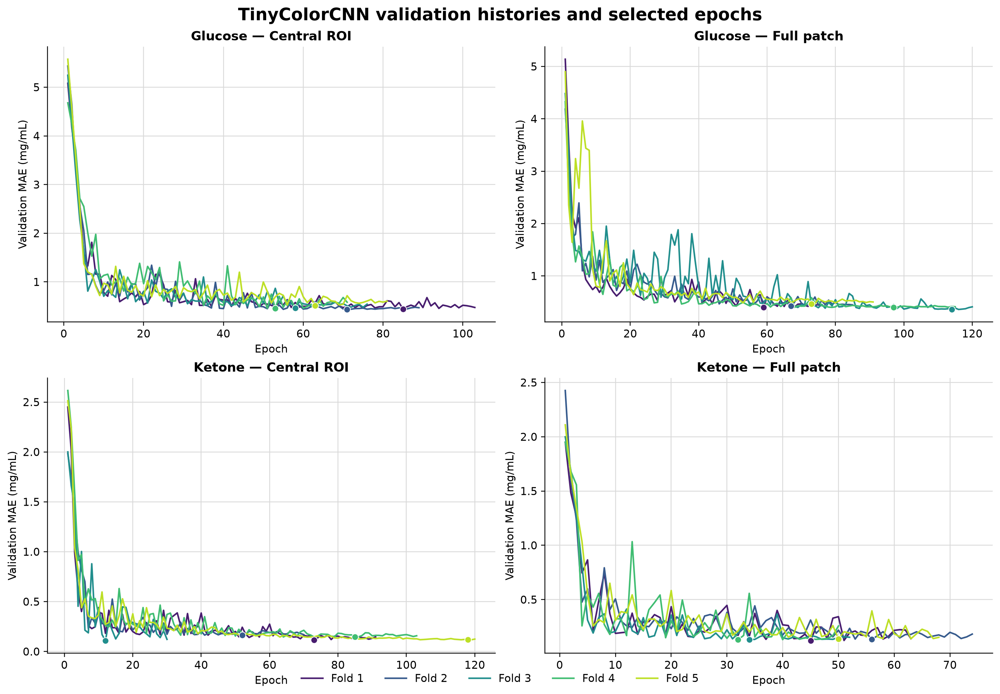

| 분석물 | 영상 입력 | 선택 epoch | 최저 validation MAE (mg/mL) |
|---|---|---:|---:|
| 포도당 | 중앙 ROI | 66.0 ± 12.5 | 0.462 ± 0.030 |
| 포도당 | 전체 패치 | 82.0 ± 22.8 | 0.411 ± 0.039 |
| 케톤 | 중앙 ROI | 68.0 ± 39.4 | 0.130 ± 0.023 |
| 케톤 | 전체 패치 | 43.4 ± 10.3 | 0.130 ± 0.006 |

- 초반 epoch에서 validation MAE가 빠르게 감소한 뒤 완만하게 안정되는 양상 확인
- 케톤 중앙 ROI에서 선택 epoch의 fold 간 변동이 크게 나타난 결과
- validation 곡선은 목표 변환과 epoch를 고르는 내부 자료이며 최종 test 성능이 아님
- 학습 손실은 표준화된 목표값의 SmoothL1, validation 값은 원 농도 단위의 MAE이므로 같은 축에 직접 겹치지 않는 구성

---

## 8. 교차검증 기반 모델 성능 평가 ✅

### 평가 원칙

- 한 번도 모델 선택에 사용하지 않은 외부 test에서 최종 성능 계산
- 농도 범위를 벗어난 예측을 물리적 측정 범위로 제한
- 패치 단위 성능과 농도별 중앙 예측 성능을 함께 계산
- MAE, RMSE, R² 및 농도 범위로 나눈 정규화 MAE 보고
- ML과 CNN에 동일한 외부 test 위치를 적용한 paired 비교

### 외부 5-fold 성능

아래 값은 패치 단위 외부 test 성능의 `평균 ± fold 간 표준편차`임. 정규화 MAE는 MAE를 각 분석물의 전체 농도 범위로 나눈 값임.

| 분석물 | 모델 | MAE (mg/mL) | RMSE (mg/mL) | R² | 정규화 MAE |
|---|---|---:|---:|---:|---:|
| 포도당 | 내부 선택 ML | **0.351 ± 0.047** | 0.912 ± 0.116 | 0.981 ± 0.005 | **1.75%** |
| 포도당 | CNN 중앙 ROI | 0.468 ± 0.033 | 0.912 ± 0.097 | 0.981 ± 0.004 | 2.34% |
| 포도당 | CNN 전체 패치 | 0.408 ± 0.036 | **0.774 ± 0.082** | **0.986 ± 0.003** | 2.04% |
| 케톤 | 내부 선택 ML | **0.041 ± 0.019** | **0.284 ± 0.155** | **0.991 ± 0.006** | **0.41%** |
| 케톤 | CNN 중앙 ROI | 0.144 ± 0.025 | 0.329 ± 0.083 | 0.990 ± 0.005 | 1.44% |
| 케톤 | CNN 전체 패치 | 0.147 ± 0.016 | 0.318 ± 0.064 | 0.991 ± 0.003 | 1.47% |

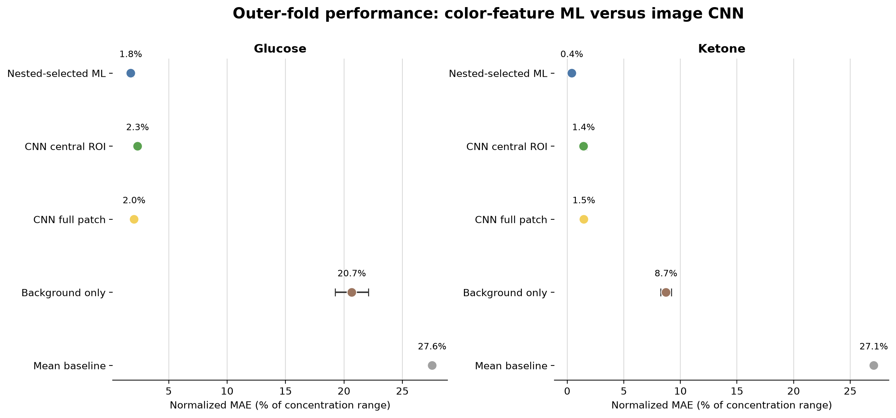

### HSV 입력 알고리즘 비교

ML 알고리즘끼리 공정하게 비교하기 위해 모두 동일한 HSV-only 특징을 사용한 외부 5-fold 평균임. CNN은 영상 입력을 사용하므로 색상 특징 모델과 입력 형태가 다름.

| 모델 | 입력 | 포도당 MAE | 포도당 R² | 케톤 MAE | 케톤 R² |
|---|---|---:|---:|---:|---:|
| Ridge | HSV-only | 1.071 ± 0.035 | 0.922 | 0.390 ± 0.029 | 0.964 |
| Elastic Net | HSV-only | 1.079 ± 0.035 | 0.920 | 0.405 ± 0.034 | 0.962 |
| SVR | HSV-only | 0.421 ± 0.035 | 0.981 | 0.101 ± 0.027 | 0.992 |
| Random Forest | HSV-only | **0.343 ± 0.041** | 0.980 | **0.040 ± 0.020** | 0.991 |
| Extra Trees | HSV-only | 0.352 ± 0.050 | 0.981 | 0.045 ± 0.017 | **0.993** |
| CNN 중앙 ROI | 패치 이미지 | 0.468 ± 0.033 | 0.981 | 0.144 ± 0.025 | 0.990 |
| CNN 전체 패치 | 패치 이미지 | 0.408 ± 0.036 | **0.986** | 0.147 ± 0.016 | 0.991 |

- Ridge와 Elastic Net보다 SVR과 트리 기반 비선형 모델의 MAE가 낮은 결과
- HSV-only Random Forest가 두 분석물에서 가장 낮은 외부 fold 평균 MAE를 보인 결과
- Extra Trees는 케톤에서 가장 높은 평균 R²를 보였지만 MAE는 Random Forest보다 큰 결과
- 포도당 전체 패치 CNN은 ML보다 MAE가 크지만 가장 높은 R²를 보인 결과

고정 HSV 모델의 외부 test 평균을 확인한 뒤 가장 좋은 알고리즘을 고르면 test 정보가 모델 선택에 사용됨. 따라서 위 표는 알고리즘별 성능을 설명하는 보조 비교이며, 최종 대표 성능은 각 fold의 내부 검증만으로 모델을 선택한 `내부 선택 ML` 결과를 사용함.

### RGB 입력 알고리즘 비교

R·G·B 중앙값을 동일하게 입력한 외부 5-fold 성능 비교임.

| 모델 | 포도당 MAE | 포도당 R² | 케톤 MAE | 케톤 R² |
|---|---:|---:|---:|---:|
| Ridge | 1.382 ± 0.029 | 0.860 | 0.684 ± 0.018 | 0.866 |
| Elastic Net | 1.403 ± 0.026 | 0.857 | 0.686 ± 0.018 | 0.866 |
| SVR | 0.663 ± 0.057 | 0.962 | 0.153 ± 0.021 | 0.988 |
| Random Forest | 0.631 ± 0.068 | 0.959 | 0.138 ± 0.035 | 0.973 |
| Extra Trees | **0.529 ± 0.034** | **0.969** | **0.087 ± 0.031** | **0.989** |

- RGB 입력에서는 Extra Trees가 두 분석물의 MAE와 R² 모두 가장 우수한 결과
- 모든 알고리즘에서 HSV 입력이 RGB 입력보다 낮은 MAE를 보인 결과
- RGB에서도 선형 모델보다 비선형 모델의 성능이 높은 결과

### Random Forest 고정 G-only 및 Hue-only 비교

HSV 입력에서 두 분석물의 MAE가 가장 낮았던 Random Forest를 하나의 비교 모델로 고정함. G-only는 `G median` 하나만 사용한 입력임. Hue-only는 0°와 360°의 연결성을 보존하기 위해 Hue 각도를 그대로 넣지 않고 `sin·cos` 두 성분을 하나의 원형 Hue 특징으로 사용한 입력임. 모델 종류는 바꾸지 않고 각 입력의 하이퍼파라미터와 목표 변환만 내부 5-fold에서 선택함.

| Random Forest 입력 | 포도당 MAE | 포도당 R² | 케톤 MAE | 케톤 R² |
|---|---:|---:|---:|---:|
| G-only | 2.471 ± 0.125 | 0.627 | 0.623 ± 0.044 | 0.859 |
| RGB | 0.631 ± 0.068 | 0.959 | 0.138 ± 0.035 | 0.973 |
| Hue-only | 0.533 ± 0.063 | 0.962 | 0.044 ± 0.022 | 0.991 |
| HSV | **0.343 ± 0.041** | **0.980** | **0.040 ± 0.020** | **0.991** |

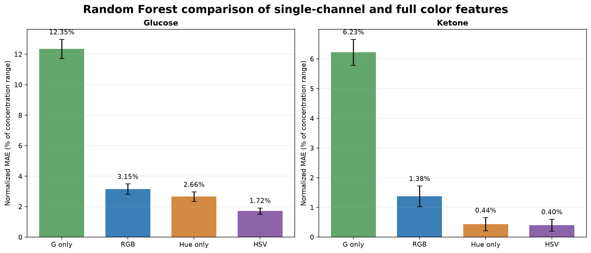

- G는 RGB 모델 안에서 가장 중요한 특징이었지만 G-only 모델의 예측 성능은 크게 낮은 결과
- 중요도 1위가 해당 특징 하나만으로 충분한 예측이 가능함을 의미하지 않는 결과
- 케톤 Hue-only MAE 0.044 mg/mL로 전체 HSV의 0.040 mg/mL와 매우 유사한 결과
- 포도당 Hue-only MAE 0.533 mg/mL로 RGB보다 낮지만 전체 HSV의 0.343 mg/mL보다 큰 결과
- 포도당은 Hue 외의 S·V 정보가 추가 성능에 기여하고, 케톤은 Hue가 예측정보 대부분을 포함했을 가능성

마지막 해석은 현재 이미지 내부의 예측 기여에 대한 결과이며 Hue 하나가 화학 반응 전체를 설명한다는 의미는 아님.

### Extra Trees 고정 G-only 및 Hue-only 비교

RGB 입력에서 두 분석물 모두 가장 좋은 성능을 보인 Extra Trees를 고정하여 같은 비교를 수행함. 모델 종류는 바꾸지 않고 입력별 하이퍼파라미터와 목표 변환만 내부 5-fold에서 선택함.

| Extra Trees 입력 | 포도당 MAE | 포도당 R² | 케톤 MAE | 케톤 R² |
|---|---:|---:|---:|---:|
| G-only | 2.463 ± 0.111 | 0.637 | 0.626 ± 0.028 | 0.866 |
| RGB | 0.529 ± 0.034 | 0.969 | 0.087 ± 0.031 | 0.989 |
| Hue-only | 0.532 ± 0.056 | 0.962 | 0.051 ± 0.023 | 0.989 |
| HSV | **0.352 ± 0.050** | **0.981** | **0.045 ± 0.017** | **0.993** |

- G-only에서 두 분석물 모두 큰 성능 저하가 나타난 결과
- 포도당 Hue-only가 RGB와 비슷한 MAE를 보였지만 HSV보다 낮은 성능을 보인 결과
- 케톤 Hue-only가 HSV와 가까운 MAE를 유지한 결과
- Random Forest와 Extra Trees에서 동일한 단일 특징 비교 결론 확인

### 단일 색상 채널 전환에 따른 경량화

아래 값은 150개 트리를 유지하고 각 fold에서 선택된 Extra Trees를 다시 학습하여 측정한 평균임. 모델 크기는 `joblib compress=3`, 입력 크기는 패치당 `float32` 특징 벡터만 계산한 값임.

| 입력 전환 | 분석물 | 수치 특징 수 | 입력 벡터 감소 | 모델 크기 | 모델 크기 변화 | 트리 노드 변화 |
|---|---|---:|---:|---:|---:|---:|
| RGB → G-only | 포도당 | 3 → 1 | 66.7% | 2.235 → 0.321 MiB | 85.6% 감소 | 88.0% 감소 |
| RGB → G-only | 케톤 | 3 → 1 | 66.7% | 1.073 → 0.352 MiB | 67.2% 감소 | 71.5% 감소 |
| HSV → Hue-only | 포도당 | 4 → 2 | 50.0% | 1.560 → 1.157 MiB | 25.8% 감소 | 29.5% 감소 |
| HSV → Hue-only | 케톤 | 4 → 2 | 50.0% | 0.796 → 1.026 MiB | 28.9% 증가 | 34.0% 증가 |

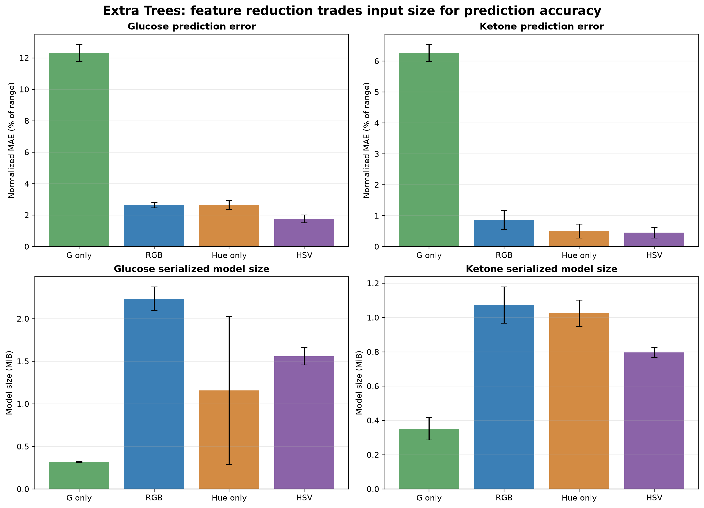

- RGB에서 G-only로 줄이면 입력 벡터와 모델 크기가 모두 감소하지만 예측 성능 저하가 매우 큰 결과
- Hue는 개념적으로 한 채널이지만 원형성을 보존하기 위해 `sin·cos` 두 수치로 입력하므로 HSV의 4개 수치 특징에서 2개로 감소
- 포도당 Hue-only는 모델 크기 25.8% 감소와 MAE 증가가 함께 나타난 절충안
- 케톤 Hue-only는 성능을 거의 유지하지만 트리 노드가 늘어 모델 자체는 경량화되지 않은 결과
- 원본 RGB 이미지의 저장 용량과 CNN 입력 채널은 그대로이므로 위 감소율은 색상 특징 기반 Extra Trees에만 해당

CNN을 RGB 3채널에서 단일 채널로 바꾸는 경우는 아직 학습하지 않았으므로 아래 값은 동일한 TinyColorCNN 구조에서 첫 합성곱 입력 수만 바꾼 이론값임.

| TinyColorCNN 계산 항목 | RGB 3채널 | 단일 채널 | 감소율 |
|---|---:|---:|---:|
| 입력 텐서/패치 (`float32`) | 108 KiB | 36 KiB | 66.7% |
| 학습 파라미터 | 169,049개 | 168,617개 | 0.256% |
| 곱셈-누산 연산/패치 | 117.449 M | 113.468 M | 3.39% |

- 입력 채널 감소가 첫 합성곱층에만 영향을 주어 전체 CNN 파라미터와 연산량 감소가 작은 구조
- 단일 채널 CNN의 실제 정확도와 추론시간은 별도 재학습 전에는 판단할 수 없음
- CNN 경량화를 연구 기여로 제시하려면 채널 축소보다 폭·깊이 축소, depthwise convolution, pruning 또는 quantization 비교가 필요한 조건

### 주요 성능 해석

- 포도당 ML의 MAE가 중앙 ROI CNN보다 5개 fold 모두에서 낮게 나타남
- 포도당 ML의 MAE가 전체 패치 CNN보다 5개 fold 중 4개에서 낮게 나타남
- 케톤 ML의 MAE가 두 CNN보다 5개 fold 모두에서 낮게 나타남
- 포도당 전체 패치 CNN은 ML보다 MAE가 높지만 RMSE와 R²는 더 우수함
- 포도당 ML은 Extra Trees가 모든 fold에서 선택되고 HSV 또는 RGB+HSV 특징이 선택됨
- 케톤 ML은 Random Forest가 모든 fold에서 선택되고 대부분 HSV 특징이 선택됨
- 현재 데이터 규모에서는 색상 특징 기반 비선형 ML이 CNN보다 더 낮은 MAE와 훨씬 짧은 최종 재학습 시간을 보임

fold가 5개뿐이므로 모델 간 차이에 대한 유의확률은 계산하지 않고, fold별 차이의 방향과 평균·표준편차를 중심으로 해석함.

### ML–CNN 차이의 위치 군집 bootstrap

같은 `well_id`에서 얻은 ML과 CNN 오차를 짝지은 뒤 96개 위치를 20,000회 재표집함. 차이는 `CNN MAE − ML MAE`이며 양수는 ML의 MAE가 더 낮음을 의미함.

| 분석물 | CNN | MAE 차이 (mg/mL) | 위치 군집 95% 구간 | 농도 범위 대비 차이 |
|---|---|---:|---:|---:|
| 포도당 | 중앙 ROI | 0.117 | 0.084–0.149 | 0.58%p |
| 포도당 | 전체 패치 | 0.057 | 0.016–0.097 | 0.29%p |
| 케톤 | 중앙 ROI | 0.104 | 0.083–0.123 | 1.04%p |
| 케톤 | 전체 패치 | 0.106 | 0.085–0.126 | 1.06%p |

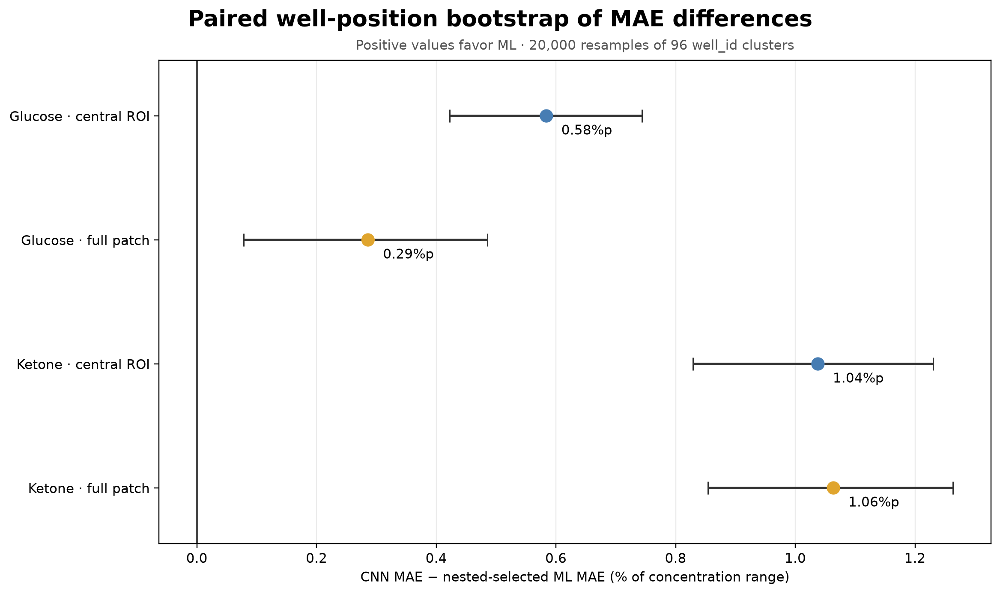

네 비교의 위치 군집 95% 구간이 모두 0보다 큰 결과임. 이는 현재 96개 센서 위치에서 ML의 낮은 MAE가 특정 위치 일부에만 의한 결과가 아님을 보여줌. 동일 원본 이미지 안의 위치를 재표집한 분석이므로 독립 이미지·플레이트·촬영 조건에 대한 신뢰구간은 아님.

### 조명 보정 특징의 민감도

특징 표현만 공정하게 비교하기 위해 동일한 Extra Trees와 외부 fold를 사용한 결과임.

| 분석물 | RGB | Chromaticity | 배경 차감 RGB | HSV |
|---|---:|---:|---:|---:|
| 포도당 MAE | 0.529 | 0.573 | 1.015 | **0.352** |
| 케톤 MAE | 0.087 | 0.062 | 0.146 | **0.045** |

- Chromaticity가 케톤 RGB보다 MAE를 낮췄지만 포도당에서는 개선되지 않은 결과
- 흰색 배경 차감이 두 분석물 모두에서 성능을 저하시킨 결과
- 현재 데이터에서는 단순 배경 차감보다 HSV 표현이 더 안정적인 결과
- 배경 보정을 기본 전처리로 채택하지 않고 촬영 교란 민감도 분석으로만 유지하는 결정

### 실제 농도와 예측 농도

아래 그림의 점은 각 외부 fold에서 같은 농도의 시험 패치 예측을 중앙값으로 요약한 결과임. 점선은 실제 농도이며 오차막대는 다섯 fold 사이의 표준편차임.

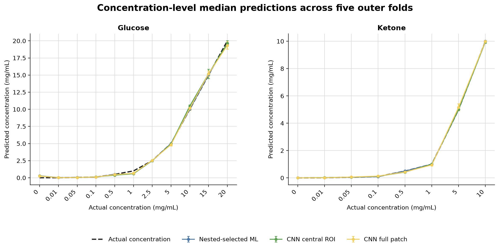

농도별 중앙값을 사용하면 모든 모델이 측정 농도 순서를 잘 따라가는 것으로 보임. 그러나 이는 각 농도의 원본 이미지가 학습과 시험에 공통으로 포함된 내부 검증 결과이므로 새로운 촬영 이미지에 대한 성능으로 해석할 수 없음.

### 농도별 오차

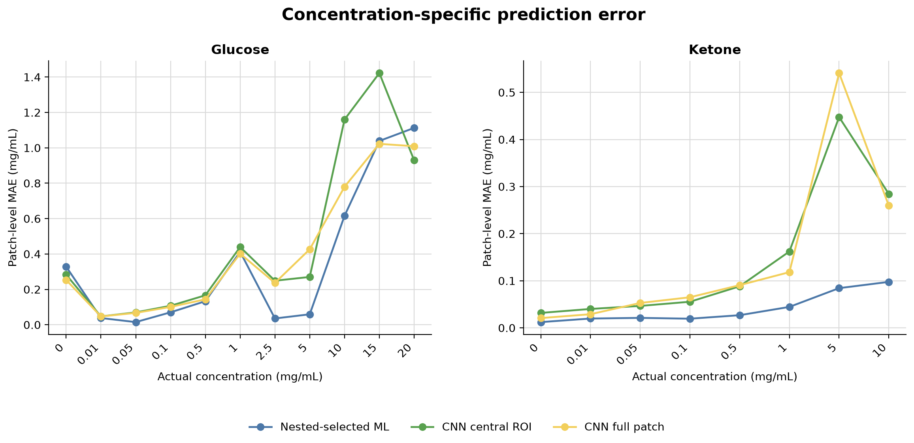

- 포도당은 주로 `10–20 mg/mL`에서 절대 오차 증가
- 중앙 ROI CNN은 포도당 `10–15 mg/mL`에서 가장 큰 오차
- 케톤 CNN은 `5 mg/mL`에서 가장 큰 오차
- 케톤 ML은 모든 측정 농도에서 패치 단위 MAE가 약 0.10 mg/mL 이하
- 저농도에서 절대 오차가 작더라도 상대 오차와 분석화학적 검출한계가 입증된 것은 아님

### 배경 음성 대조

| 분석물 | 배경-only MAE | 배경-only R² | 주 모델과의 비교 |
|---|---:|---:|---|
| 포도당 | 4.134 mg/mL | 0.015 | 센서 색상 모델보다 현저히 낮은 성능 |
| 케톤 | 0.873 mg/mL | 0.725 | 센서 색상 모델보다 낮지만 배경에도 농도 관련 정보가 존재 |

케톤 배경-only 모델의 R²가 0.725로 나타난 결과는 촬영 배경 또는 이미지별 조건이 농도와 함께 변했을 가능성을 의미함. 센서 색상 모델이 배경-only보다 우수하다는 사실만으로 교란 가능성이 제거되는 것은 아님.

### 모델 크기와 추론시간

| 분석물 | 모델 | 평균 저장 크기 | 평균 패치당 추론시간 |
|---|---|---:|---:|
| 포도당 | 내부 선택 ML | 1.59 MB | 0.059 ms |
| 포도당 | CNN | 0.69 MB | 0.094–0.105 ms |
| 케톤 | 내부 선택 ML | 0.31 MB | 0.105 ms |
| 케톤 | CNN | 0.69 MB | 0.097–0.110 ms |

ML 추론은 CPU, CNN 추론은 GPU에서 측정한 값이므로 하드웨어가 통일된 직접 속도 비교가 아닌 현재 실행 환경의 참고값임.

### 반드시 유지해야 하는 해석 범위

농도별 독립 촬영 이미지가 1장뿐이므로 학습과 시험에 같은 원본 이미지의 서로 다른 패치가 포함됨. 따라서 높은 R²와 낮은 MAE는 **현재 이미지 내부에서 위치가 다른 패치를 예측한 성능**임. 새로운 플레이트, 새로운 스마트폰 촬영, 독립 반복 이미지 또는 측정하지 않은 중간 농도에 대한 성능을 입증한 결과가 아님.

---

## 9. SHAP 및 Permutation Importance 분석 ✅

### 분석 원칙

- RGB-only와 HSV-only 모델을 분리하여 상관된 색 공간 사이의 기여도 분산 방지
- 포도당은 Extra Trees, 케톤은 Random Forest를 각 외부 fold의 학습 데이터에서 재학습
- SHAP 값의 단위를 농도와 맞추기 위해 설명용 모델은 원 농도를 목표값으로 사용
- 한 번도 해당 모델 학습에 사용되지 않은 외부 test 패치에서만 설명값 계산
- Hue의 `sin·cos` 두 성분을 하나의 Hue 기여도로 합산
- TreeSHAP과 30회 반복 permutation importance를 함께 사용하여 중요도 교차 확인
- 특징값과 SHAP 값의 상관 방향을 농도별로 관찰된 실제 색상 변화 방향과 비교

### 주요 색상 채널

아래 비율은 각 색 공간 안에서 전체 SHAP 중요도를 100%로 정규화한 상대값임. RGB와 HSV의 비율을 서로 직접 비교하는 값이 아니라 각 색 공간 안의 특징 순위를 나타내는 값임.

| 분석물 | RGB 1위 | SHAP 비율 | HSV 1위 | SHAP 비율 |
|---|---|---:|---|---:|
| 포도당 | G | 65.2% | Hue | 85.1% |
| 케톤 | G | 67.5% | Hue | 98.9% |

- permutation importance에서도 포도당 G 59.2%·Hue 91.7%, 케톤 G 66.9%·Hue 97.8%로 같은 1위 특징 확인
- 포도당 HSV-only 설명 모델의 MAE 0.350 mg/mL, 케톤 HSV-only 설명 모델의 MAE 0.040 mg/mL
- RGB-only 설명 모델보다 HSV-only 설명 모델에서 더 낮은 MAE 확인

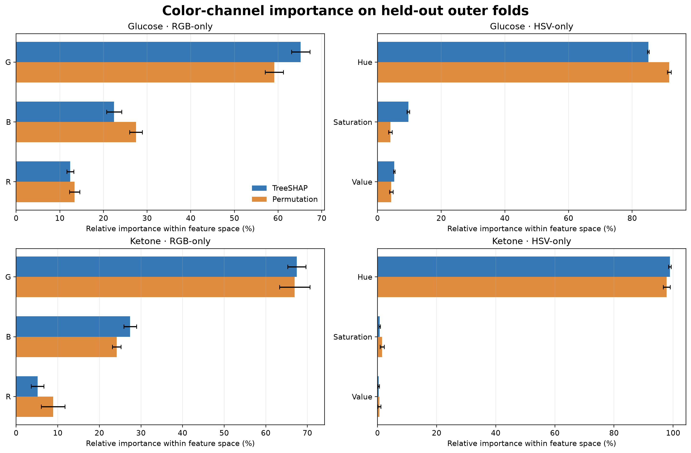

---

## 10. 특징 중요도의 재현성 평가 ✅

### 평가 기준

- 각 외부 fold에서 SHAP 중요도 1위 특징을 독립적으로 확인
- 같은 fold에서 permutation importance 1위와 SHAP 1위의 일치 여부 확인
- 특징값 증가·감소에 따른 SHAP 기여 방향이 fold마다 반복되는지 확인
- 특정 fold의 우연한 중요도 결과가 아닌 5개 fold의 선택 빈도로 재현성 평가

### fold 반복 결과

| 분석물 | 색 공간 | 반복된 1위 특징 | SHAP 1위 | Permutation 1위 | 관찰 방향과 SHAP 방향 일치 |
|---|---|---|---:|---:|---:|
| 포도당 | RGB-only | G | 5/5 fold | 5/5 fold | 5/5 fold |
| 포도당 | HSV-only | Hue | 5/5 fold | 5/5 fold | 5/5 fold |
| 케톤 | RGB-only | G | 5/5 fold | 5/5 fold | 5/5 fold |
| 케톤 | HSV-only | Hue | 5/5 fold | 5/5 fold | 5/5 fold |

- 네 분석 조합 모두에서 SHAP과 permutation의 1위 특징이 모든 fold에서 일치한 결과
- 포도당 G·Hue와 케톤 G·Hue의 SHAP 기여 방향이 모든 fold에서 동일하게 반복된 결과
- fold 간 SHAP 비율의 표준편차가 포도당 G 2.1%p·Hue 0.3%p, 케톤 G 2.2%p·Hue 0.5%p 수준
- 현재 데이터 안의 위치 변화에 대해서는 중요 특징의 순위와 방향이 안정적인 결과

동일 농도의 독립 촬영 반복이 없으므로 이 재현성은 **위치 그룹 fold 사이의 내부 재현성**임. 새로운 이미지·플레이트·촬영 조건 사이의 재현성으로 확대 해석할 수 없음.

---

## 11. 색상 변화와 모델 설명의 화학적 개연성 비교 ✅

### 관찰된 색 변화와 예측 기여 방향

| 분석물 | 특징 | 관찰된 농도 변화 ρ | 특징값–SHAP ρ | 해석 |
|---|---|---:|---:|---|
| 포도당 | G | 0.900 | 0.966 | G 증가가 높은 농도 예측에 기여 |
| 포도당 | Hue | -0.900 | -0.892 | Hue 감소가 높은 농도 예측에 기여 |
| 케톤 | G | -0.976 | -0.918 | G 감소가 높은 농도 예측에 기여 |
| 케톤 | Hue | -1.000 | -0.977 | Hue 감소가 높은 농도 예측에 기여 |

- 네 주요 특징 모두 관찰된 색 변화 방향과 SHAP 기여 방향이 5개 fold 전부에서 일치
- 포도당 G와 케톤 G의 반대 방향을 모델이 구분하여 사용한 결과
- SHAP과 permutation에서 동일한 주요 특징이 나타나 단일 중요도 방법에만 의존하지 않은 결과

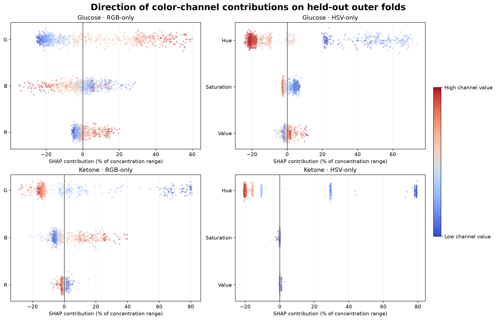

### CNN의 공간 의존도

중앙 ROI는 전체 패치 면적의 포도당 26.9%, 케톤 27.0%임. 절댓값 Grad-CAM과 중앙·바깥 가림 검사를 함께 적용한 결과임.

| 분석물 | CNN 입력 | 중앙 ROI 안의 Grad-CAM | 면적 대비 집중도 |
|---|---|---:|---:|
| 포도당 | 중앙 ROI | 75.3% | 2.80배 |
| 포도당 | 전체 패치 | 44.6% | 1.65배 |
| 케톤 | 중앙 ROI | 78.3% | 2.90배 |
| 케톤 | 전체 패치 | 40.4% | 1.50배 |

- 전체 패치 CNN에서도 중앙 ROI가 면적 비율보다 높은 Grad-CAM 비중을 보여 센서 중앙을 우선 사용한 결과
- 전체 패치 CNN의 중앙 ROI 면적 10%당 가림 변화가 포도당 0.789 mg/mL, 케톤 0.229 mg/mL로 바깥 영역의 0.383 mg/mL와 0.173 mg/mL보다 큰 결과
- 전체 패치 CNN의 Grad-CAM 중 포도당 55.4%, 케톤 59.6%가 중앙 ROI 바깥에 남아 있어 테두리와 주변 픽셀도 함께 사용한 결과
- 중앙 ROI 제한이 주변 정보 의존을 줄이지만 포도당에서는 전체 패치 CNN보다 MAE가 증가한 성능·강건성 상충관계

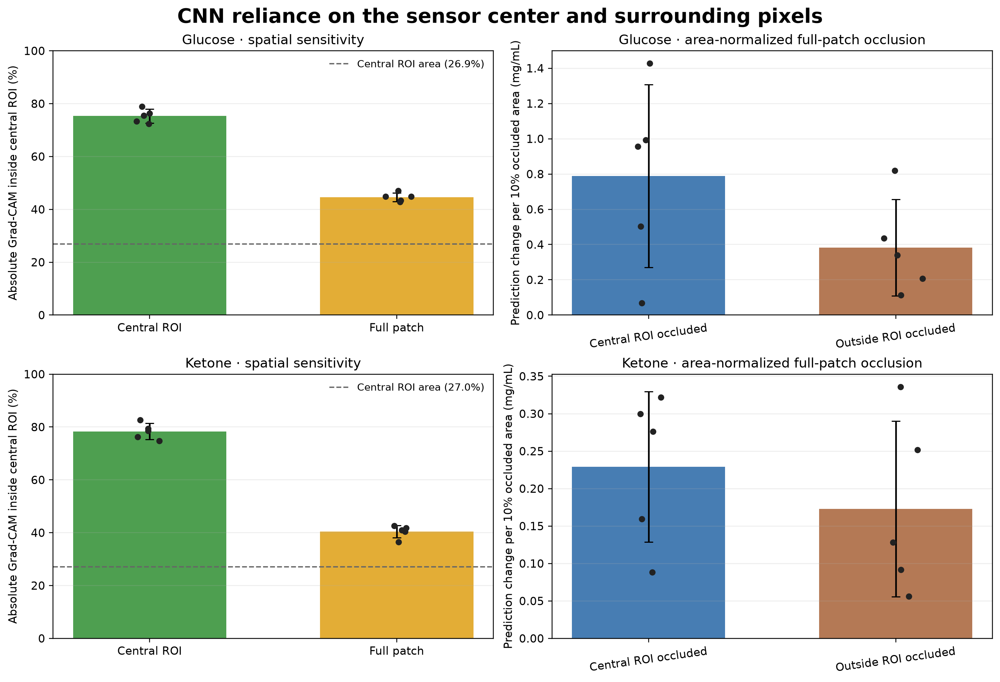

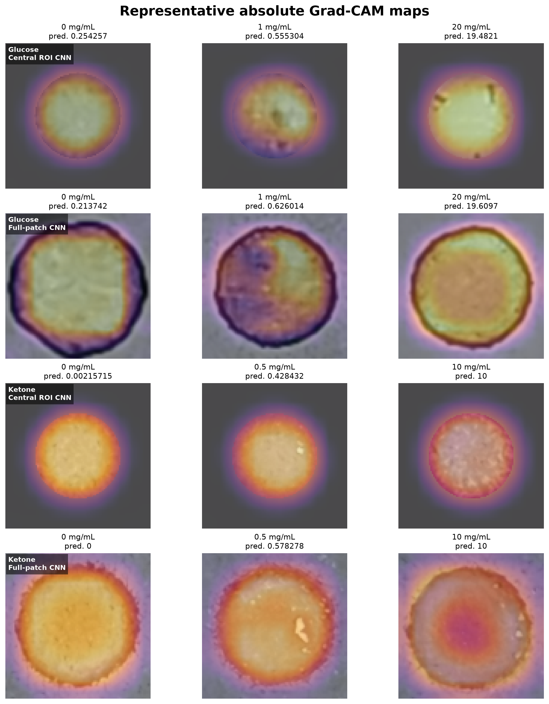

### 최종 해석

색상 특징 모델이 주로 사용한 G와 Hue의 기여 방향이 실제 이미지에서 관찰된 농도별 색 변화 방향과 위치 그룹 외부 fold에서 반복적으로 일치함. CNN도 센서 중앙을 면적보다 높은 비율로 사용했지만 전체 패치 모델은 테두리와 주변 픽셀에도 상당한 민감도를 보임.

이 결과는 **현재 19개 이미지 안에서 모델의 판단 근거가 관찰된 색 변화와 일치함을 보여주는 내부 설명 결과**임. SHAP·Grad-CAM·가림 검사는 화학 반응의 인과성을 증명하지 않으며, 농도별 독립 촬영 이미지가 없으므로 새로운 플레이트와 촬영 조건에서 설명 방향이 재현된다고 결론 내릴 수 없음.
